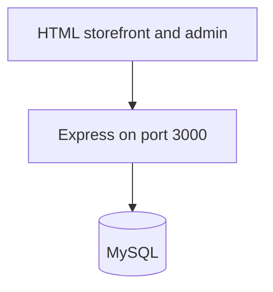
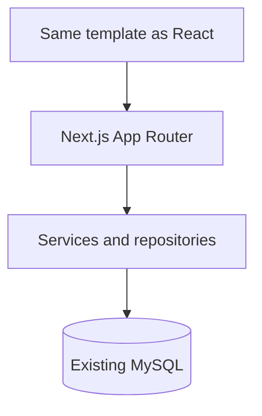

# Next.js migration of JustAclick

## Current architecture

Static HTML at the repo root is served by Express ([server/src/index.js](server/src/index.js)) together with `/assets`, `/uploads`, and `/admin`. The browser calls `/api/*` via [assets/js/api.js](assets/js/api.js) (Bearer token in `localStorage` plus an HttpOnly `token` cookie). Guest carts use an HttpOnly `sid` cookie and merge into the user cart on register/login ([server/src/routes/auth.js](server/src/routes/auth.js)).

**What exists**

- Storefront pages: `index.html`, `product.html`, `product-details.html`, `categories.html`, `cart.html`, `payment.html` (checkout), `login.html`, `signup.html`, `orders.html`, `order-details.html`, `invoice.html`, `whishlist.html`, plus static `about-us.html`, `contact-us.html`, `blogs.html`, `blogs-details.html`.
- Admin: `admin/index.html`, `products.html`, `product-form.html`, `inventory.html`, `orders.html`, `order-detail.html`, `invoice.html`, `customers.html`, `reports.html`. Shared chrome is duplicated in each HTML file (header, mega menu, footer).
- CSS/JS to keep as the visual source of truth: [assets/css/](assets/css/) (`global.css`, `style.css`, `design.css`, page CSS), vendor Bootstrap, Boxicons, Slick, Swiper. DOM behavior lives in `assets/js/index.js`, `shop.js`, `carousels.js`, `filter.js`, `auth-ui.js`, `admin/js/admin-common.js`.
- Currency INR. Shipping is a flat `SHIPPING_FLAT_INR` (default 99), calculated on the server in [server/src/routes/cart.js](server/src/routes/cart.js). Checkout is **Cash on Delivery only**. There is no payment gateway, coupon, variant, brand, address book, forgot-password, or email sender.
- Order states already in code: `pending` → `confirmed` | `cancelled`; `confirmed` → `shipped` | `cancelled`; `shipped` → `delivered`. Stock drops only when an admin confirms (`stock_deducted`). Prices on the order are snapshots from the server cart, not from the browser.
- **Blocker:** [server/src/db/migrate.js](server/src/db/migrate.js) reads `server/src/db/schema.sql`, and that file is not in the repo. Table shapes must come from the live MySQL database (introspection), not from guesses. Columns implied by queries: `users`, `categories`, `products` (incl. `compare_at_price`, `badge`, `grade_label`, `sku`), `product_images`, `carts`, `cart_items`, `wishlists`, `orders`, `order_items`, `invoices`, `inventory_logs`.
- [server/.env.example](server/.env.example) contains real-looking database and JWT values. Do not copy those into git. Rotate them and publish placeholders only.

## Target architecture

New app in `web/` so the current HTML stays available for side-by-side visual checks until cutover. Hostinger will run `web` as a Node server (`next start`), not a static export.

- Server Components by default. `"use client"` only for menu, search overlay, sliders, qty, cart buttons, filters, forms.
- Page → Server Action or Route Handler → service → repository → `mysql2` pool (same named SQL). Prisma is added only after `prisma db pull` matches the live tables; until then queries stay as SQL so behavior does not drift.
- Auth: HttpOnly `token` cookie only. Stop writing the JWT to `localStorage`.
- Public product URLs: `/products/[slug]`. Search: `/search?q=` (today search posts to `product.html?q=`).
- Keep flat COD checkout, shipping env, order transitions, and guest-cart merge. Do not add Razorpay, coupons, or extra order statuses.
- Global CSS imported as-is under `web/src/styles/` (and vendor CSS). `class` → `className` only. No Tailwind conversion.
- Images: copy `assets/` and `uploads/` into `web/public/`. Use `next/image` only where width/height and object-fit match the current ``. Uploaded product files stay on disk under `public/uploads` (or a writable Hostinger path), served as static files.

## File migration map

- `index.html` → `web/src/app/(store)/page.tsx` plus `components/home/*` (hero, categories, featured, banners, newsletter) and shared `components/layout/Header.tsx`, `Nav.tsx`, `Footer.tsx`
- `categories.html` → `web/src/app/(store)/categories/[slug]/page.tsx` (listing still driven by category slug, same as `/api/products?category=`)
- `product.html` → `web/src/app/(store)/products/page.tsx` (grid, sort, pagination)
- `product.html?q=` → `web/src/app/(store)/search/page.tsx`
- `product-details.html` → `web/src/app/(store)/products/[slug]/page.tsx`
- `cart.html` → `web/src/app/(store)/cart/page.tsx`
- `payment.html` → `web/src/app/(store)/checkout/page.tsx`
- `login.html` / `signup.html` → `web/src/app/(auth)/login/page.tsx` and `register/page.tsx`
- `orders.html`, `order-details.html`, `invoice.html`, `whishlist.html` → `web/src/app/account/orders`, `orders/[id]`, `orders/[id]/invoice`, `wishlist`
- `about-us.html`, `contact-us.html`, `blogs.html`, `blogs-details.html` → static routes under `(store)` with the same markup (no CMS; blogs are not in the database)
- `admin/*.html` → `web/src/app/admin/*` using [admin/css/admin.css](admin/css/admin.css)
- `/api/auth/*` → `actions/auth.actions.ts` (register, login, logout, me)
- `/api/products`, `/api/categories` → `services` + repositories; public reads from Server Components
- `/api/cart`, `/api/wishlist` → `actions/cart.actions.ts`, `actions/wishlist.actions.ts`
- `/api/orders` → `actions/order.actions.ts` (place COD, list, detail). Admin status stays server-only
- `/api/admin/*` → `app/admin` server actions guarded by `role === 'admin'`
- Uploads → `app/api/uploads/route.ts` (multer equivalent: validate image type/size, write under `uploads/products`)

## Feature rules to preserve

- Search: `q`, `category`, sort `newest | price-low | price-high | name`, page size up to 48. No brand/attribute filters exist; do not invent them.
- Cart: add, update qty, remove, clear; subtotal and shipping from DB prices; guest `sid` + logged-in cart merge on login.
- Checkout: login required; fields `given-name`, `family-name`, street, city, postal code, notes; payment method `cod`; payment status `unpaid`; invoice row created; cart cleared in the same transaction.
- Inventory: adjust endpoint and confirm-order deduction with `inventory_logs`. Cancel restores stock only if it was deducted.
- Wishlist: per logged-in user, toggle by product id.
- Admin: dashboard counts, product CRUD (soft-delete via `is_active = 0`), categories, orders, customer notes/phone, sales report.
- SEO: port existing `<title>` and description from each HTML file into `generateMetadata`. Product metadata from `name`, `description`, primary image. `sitemap.ts` lists home, categories, active products, about, contact, blogs. `robots.ts` disallows `/admin`, `/account`, `/checkout`. JSON-LD only for fields that exist (Product, Offer with INR price, BreadcrumbList, Organization, WebSite). No FAQ schema.
- Security: parameterized SQL only; admin layout checks role; checkout totals recomputed server-side; cookies `httpOnly`, `sameSite=lax`, `secure` when `COOKIE_SECURE=true`.

## Implementation order

Work in small slices. Leave the Express app runnable until the Next.js build replaces it.

1. Scaffold `web/` (Next.js, TypeScript, App Router, `mysql2`, `bcryptjs`, `jsonwebtoken`). `output` default Node server. `.env.example` with `DATABASE_URL` or `DB_*`, `JWT_SECRET`, `NEXT_PUBLIC_APP_URL`, `SHIPPING_FLAT_INR`. No secrets committed.
2. Introspect the live database and record the real `CREATE TABLE` definitions. Add Prisma schema with `@@map` only if introspection succeeds; otherwise keep the SQL repositories.
3. Copy CSS, fonts, icons, images, and vendor styles into `web/public` and `web/src/styles` without rewriting rules.
4. Extract header, mega menu, footer as client islands where the current JS toggles them. Build the homepage from `index.html` section by section.
5. Product listing, category, search, product detail wired to repositories.
6. Auth cookies, account pages, wishlist.
7. Cart, checkout, orders, invoice.
8. Admin modules and uploads.
9. Metadata, sitemap, robots, JSON-LD.
10. `npm run build` and `npm start` against MySQL. Compare each route to the old HTML at desktop and mobile widths before removing Express static hosting.
11. Run the full case list below locally against the real MySQL database.
12. Package the production app and upload it to Hostinger Node.js hosting.

## Full test cases (must pass before upload)

Run against `npm start` with the existing database. Record pass or fail for each case. Do not upload if checkout, auth, or admin order confirmation fails.

- Public pages render with the existing CSS: home, products, product detail, category, search, about, contact, blogs, cart, login, register.
- Search `?q=` returns matching names, descriptions, and SKUs. Sort and category filter match the current API.
- Guest add to cart, change quantity, remove line, cart count, subtotal, and flat shipping.
- Register, login, logout. Guest cart merges into the customer cart. Session survives refresh via the HttpOnly cookie.
- Wishlist toggle only for a logged-in customer.
- Checkout requires login. COD order writes `orders`, `order_items`, and `invoices` using server prices. Cart is empty afterward. Stock does not change while status is `pending`.
- Customer can open order history, order detail, and invoice.
- Admin login cannot be used as a customer-only mistake: non-admins get blocked from `/admin`.
- Admin can create and edit a product with an image upload, adjust stock, confirm an order (stock decreases once), ship, deliver, and cancel a confirmed order (stock returns once).
- Dashboard and sales report numbers match the database.
- `npm run build` succeeds. No `NEXT_PUBLIC_` database or JWT secrets. Sitemap and robots exclude `/admin`, `/account`, and `/checkout`.

## Hostinger upload

Target is Hostinger Node.js web hosting (not a static HTML upload). The live MySQL database stays the one already configured (`DB_HOST`, `DB_NAME`, and user from the current server env). Secrets stay in the Hostinger environment panel, not in git.

- App root for the host is `web/` after `npm run build`.
- Start command: `npm start` (`next start`). Node 18 or newer. Port from Hostinger `PORT`.
- Set `COOKIE_SECURE=true`, `NEXT_PUBLIC_APP_URL` to the live domain, and the same `DB_*` / `JWT_SECRET` / `SHIPPING_FLAT_INR` values used in production.
- Upload `public/assets` and keep `uploads/products` writable on the server so admin images survive deploys.
- After upload, repeat smoke tests on the live URL: home, product page, login, add to cart, COD checkout, admin confirm order.

I cannot log into hPanel from this environment. Upload uses the Hostinger Node.js app (Git or file manager / SSH) once the build is green. If SSH or the panel is not available in this session, the deliverable is a production build plus the exact env and start settings to paste into hPanel.

## Out of scope unless you ask later

Payment gateways, coupons, product variants, email, password reset, and any visual redesign. Those features are not in the current backend.
